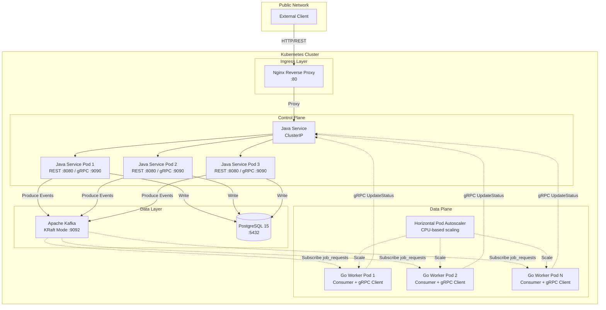
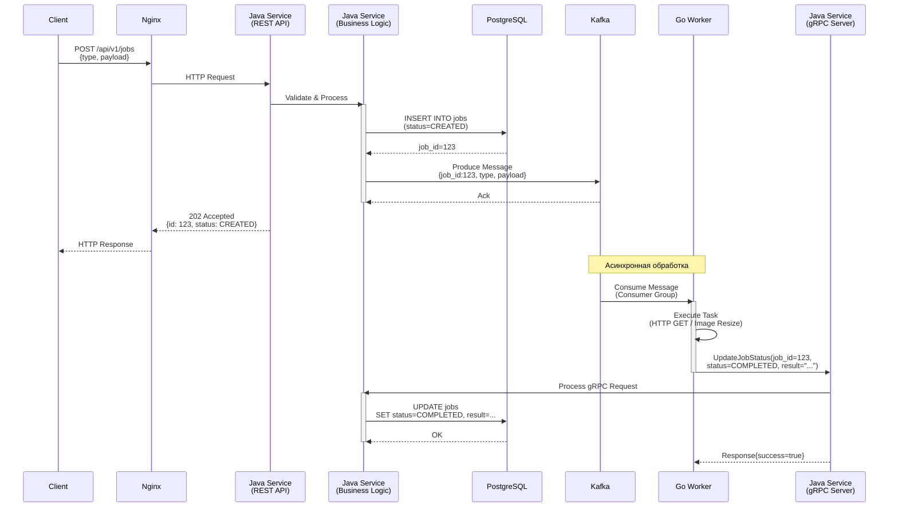
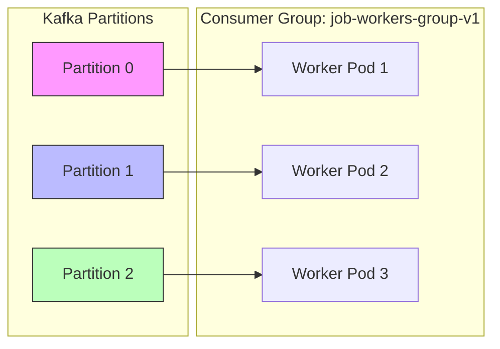
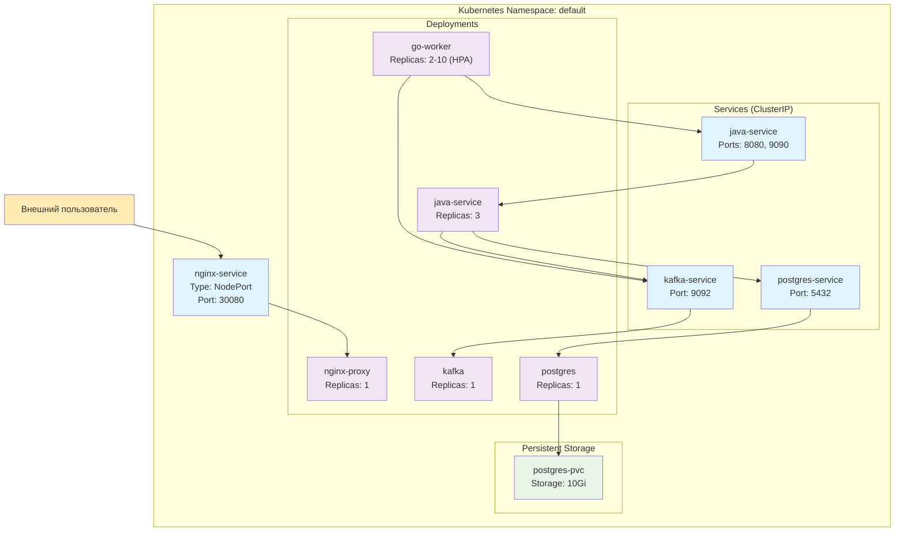

# Distributed Job Processing Platform

Высокопроизводительная платформа для асинхронной обработки фоновых задач с горизонтальным масштабированием. Система построена на микросервисной архитектуре с разделением на Control Plane (управление) и Data Plane (исполнение), использует событийную модель взаимодействия и обеспечивает гарантированную доставку сообщений.

## Обзор архитектуры

Платформа реализует паттерн **Producer-Consumer** с гибридной коммуникацией: задачи распределяются через Apache Kafka (асинхронно), а результаты возвращаются через gRPC (синхронно) для минимизации латентности обновлений.

### Архитектура высокого уровня



### Принципы проектирования

**Разделение ответственности**

- **Control Plane (Java Service):** Принимает клиентские запросы, управляет состоянием задач в базе данных, координирует распределение нагрузки.
- **Data Plane (Go Workers):** Выполняют вычислительно-интенсивные задачи, изолированы от клиентского трафика, горизонтально масштабируются.

**Асинхронность и отказоустойчивость**

- Kafka обеспечивает буферизацию задач и защиту от перегрузок (backpressure).
- At-least-once семантика доставки: задачи не теряются даже при падении воркеров.
- Graceful shutdown с корректным завершением транзакций.

## Технологический стек

### Backend Services

| Компонент | Технология | Версия | Роль |
|-----------|-----------|--------|------|
| **Control Plane** | Java + Spring Boot | 3.2 / Java 17 | Оркестрация, REST API, gRPC сервер |
| **Data Plane** | Go | 1.25 | Асинхронная обработка задач |
| **Message Broker** | Apache Kafka (Bitnami) | Latest (KRaft) | Распределение задач, event streaming |
| **Database** | PostgreSQL | 15 | Персистентное хранилище состояний |
| **Reverse Proxy** | Nginx | Alpine | Rate limiting, SSL termination |

### Протоколы и форматы

| Протокол | Применение | Особенности |
|----------|-----------|-------------|
| **REST/HTTP** | Client → Java Service | JSON payloads, стандартные HTTP коды |
| **gRPC** | Workers → Java Service | Protobuf, низкая латентность (<5ms) |
| **Kafka Protocol** | Java → Kafka → Workers | Протобуф сериализация, партиционирование |

### Инфраструктура

| Технология | Применение |
|------------|-----------|
| **Kubernetes** | Оркестрация контейнеров, service discovery, автомасштабирование |
| **Docker** | Контейнеризация сервисов |
| **Kustomize** | Декларативное управление Kubernetes манифестами |

## Компоненты системы

### Java Service (Control Plane)

Центральный компонент управления, построенный на Spring Boot с четкой слоистой архитектурой.

**Ключевые возможности:**

- REST API с валидацией входящих данных (Bean Validation).
- Транзакционная запись в PostgreSQL через Spring Data JPA.
- Идемпотентная публикация событий в Kafka с партиционированием по job_id.
- gRPC сервер для приема результатов от воркеров с минимальной латентностью.
- Health checks и метрики через Spring Actuator.

**Endpoints:**

- `POST /api/v1/jobs` - Создание задачи (возвращает 202 Accepted).
- `GET /api/v1/jobs/{id}` - Получение статуса задачи.
- `GET /api/v1/jobs?status=CREATED&page=0&size=20` - Список задач с пагинацией.

**Технологии:**

- Spring Boot 3.2, Spring Data JPA, Spring Kafka.
- gRPC Spring Boot Starter (`net.devh`).
- PostgreSQL Driver, HikariCP connection pooling.
- Flyway для миграций схемы БД.

### Go Worker (Data Plane)

Высокопроизводительный обработчик задач на Go с конкурентной моделью выполнения.

**Ключевые возможности:**

- Worker Pool с фиксированным размером горутин (по умолчанию 10).
- Kafka Consumer с consumer group для распределения партиций.
- Модульная система executors для разных типов задач.
- gRPC клиент с автоматическими retry и backoff.
- Graceful shutdown с таймаутом на завершение текущих задач.

**Типы задач:**

- `HTTP_GET` - Выполнение HTTP запроса и извлечение данных.
- `IMAGE_RESIZE` - Обработка изображений (симуляция или реальная через imaging библиотеки).
- `SLEEP` - Задержка для тестирования (mock executor).

**Технологии:**

- Go 1.25, goroutines, channels.
- `segmentio/kafka-go` для Kafka Consumer.
- `google.golang.org/grpc` и `google.golang.org/protobuf`.
- Структурированное логирование через `log/slog`.

### Nginx Reverse Proxy

Точка входа для всех внешних запросов с функциями защиты и маршрутизации.

**Функции:**

- Проксирование на Java Service backend с балансировкой нагрузки.
- Rate limiting (защита от DDoS и abuse).
- Connection pooling с keepalive для снижения латентности.
- Централизованная точка для будущего SSL termination.

**Конфигурация:**

```nginx
upstream java_backend {
    server java-service:8080 max_fails=3 fail_timeout=30s;
    keepalive 32;
}

server {
    listen 80;
    
    location / {
        proxy_pass http://java_backend;
        proxy_set_header Host $host;
        proxy_set_header X-Real-IP $remote_addr;
        proxy_http_version 1.1;
        proxy_set_header Connection "";
    }
}
```

### Apache Kafka

Распределенная очередь сообщений в режиме KRaft (без Zookeeper).

**Конфигурация:**

- Топик: `job_requests` (3 партиции для параллелизма).
- Consumer Group: `job-workers-group-v1` (воркеры распределяют партиции между собой).
- At-least-once семантика с ручным commit offset.

**Особенности:**

- Партиционирование по `job_id` гарантирует, что задачи одного клиента обрабатываются по порядку.
- Replication factor 1 (для dev), 2-3 (для production).

### PostgreSQL

Реляционная СУБД для хранения метаданных задач.

**Схема таблицы jobs:**

```sql
CREATE TABLE jobs (
    id BIGSERIAL PRIMARY KEY,
    type VARCHAR(50) NOT NULL,
    status VARCHAR(50) NOT NULL DEFAULT 'CREATED',
    payload JSONB NOT NULL,
    result TEXT,
    error_message TEXT,
    created_at TIMESTAMP WITH TIME ZONE DEFAULT CURRENT_TIMESTAMP,
    updated_at TIMESTAMP WITH TIME ZONE DEFAULT CURRENT_TIMESTAMP,
    version INTEGER DEFAULT 0
);

CREATE INDEX idx_jobs_status_created ON jobs(status, created_at DESC);
```

**Оптимизации:**

- JSONB для гибкого хранения payload без изменения схемы.
- Составные индексы для частых запросов (фильтрация по статусу + сортировка).
- Оптимистичные блокировки через `version` поле.

## Поток данных

### Создание и обработка задачи



### Горизонтальное масштабирование



Каждый воркер обрабатывает свою партицию. При добавлении новых подов происходит rebalance, и партиции перераспределяются автоматически.

## Kubernetes развертывание

### Топология кластера



### Ресурсы и масштабирование

**Java Service:**

```yaml
resources:
  requests:
    memory: "512Mi"
    cpu: "500m"
  limits:
    memory: "1Gi"
    cpu: "1000m"
replicas: 3
```

**Go Worker с HPA:**

```yaml
resources:
  requests:
    memory: "256Mi"
    cpu: "200m"
  limits:
    memory: "512Mi"
    cpu: "500m"

# HorizontalPodAutoscaler
minReplicas: 2
maxReplicas: 10
targetCPUUtilizationPercentage: 70
```

### Init Containers

Go Worker использует init container для ожидания готовности Kafka перед стартом основного контейнера:

```yaml
initContainers:
- name: wait-for-kafka
  image: busybox:1.36
  command:
    - sh
    - -c
    - |
      echo "Waiting for kafka-service:9092..."
      until nc -z kafka-service 9092; do
        sleep 2
      done
      echo "Kafka is up"
```

### Health Probes

**Java Service:**

```yaml
livenessProbe:
  httpGet:
    path: /actuator/health/liveness
    port: 8080
  initialDelaySeconds: 60
  periodSeconds: 10

readinessProbe:
  httpGet:
    path: /actuator/health/readiness
    port: 8080
  initialDelaySeconds: 30
  periodSeconds: 5
```

## Конфигурация

### Переменные окружения

**Java Service:**

| Переменная | Описание | Значение по умолчанию |
|-----------|----------|---------------------|
| `SERVER_PORT` | REST API порт | `8080` |
| `GRPC_PORT` | gRPC сервер порт | `9090` |
| `SPRING_DATASOURCE_URL` | JDBC URL PostgreSQL | `jdbc:postgresql://postgres-service:5432/jobsdb` |
| `SPRING_DATASOURCE_USERNAME` | Имя пользователя БД | `postgres` |
| `SPRING_DATASOURCE_PASSWORD` | Пароль БД | `postgres` |
| `KAFKA_BROKERS` | Адреса Kafka брокеров | `kafka-service:9092` |
| `KAFKA_TOPIC` | Топик для задач | `job_requests` |

**Go Worker:**

| Переменная | Описание | Значение по умолчанию |
|-----------|----------|---------------------|
| `KAFKA_BROKERS` | Адреса Kafka брокеров | `kafka-service:9092` |
| `KAFKA_TOPIC` | Топик для чтения | `job_requests` |
| `KAFKA_GROUP_ID` | Consumer group ID | `job-workers-group-v1` |
| `GRPC_SERVER_ADDRESS` | Адрес Java gRPC | `java-service:9090` |
| `WORKER_POOL_SIZE` | Размер пула воркеров | `10` |
| `LOG_FORMAT` | Формат логов | `text` |

## API документация

### Создание задачи

**Request:**

```http
POST /api/v1/jobs HTTP/1.1
Host: localhost:8080
Content-Type: application/json

{
  "type": "SLEEP",
  "payload": {
    "duration_ms": 5000
  }
}
```

**Response:**

```http
HTTP/1.1 202 Accepted
Content-Type: application/json

{
  "id": 123,
  "type": "SLEEP",
  "status": "CREATED",
  "payload": "{\"duration_ms\":5000}",
  "result": null,
  "created_at": "2026-02-04T15:30:00Z",
  "updated_at": "2026-02-04T15:30:00Z"
}
```

### Получение статуса задачи

**Request:**

```http
GET /api/v1/jobs/123 HTTP/1.1
Host: localhost:8080
```

**Response:**

```http
HTTP/1.1 200 OK
Content-Type: application/json

{
  "id": 123,
  "type": "SLEEP",
  "status": "COMPLETED",
  "payload": "{\"duration_ms\":5000}",
  "result": "Slept for 5000ms",
  "created_at": "2026-02-04T15:30:00Z",
  "updated_at": "2026-02-04T15:30:05Z"
}
```

### Список задач с фильтрацией

**Request:**

```http
GET /api/v1/jobs?status=COMPLETED&page=0&size=20 HTTP/1.1
Host: localhost:8080
```

**Response:**

```http
HTTP/1.1 200 OK
Content-Type: application/json

{
  "content": [
    {
      "id": 123,
      "type": "SLEEP",
      "status": "COMPLETED",
      ...
    }
  ],
  "pageable": {
    "pageNumber": 0,
    "pageSize": 20
  },
  "totalElements": 156,
  "totalPages": 8
}
```

## Запуск

### Локальное развертывание (Docker Compose)

```bash
# Клонирование репозитория
git clone https://github.com/Roman-Samoilenko/distributed-job-processing-platform.git
cd job-processing-platform

# Запуск всех сервисов
docker-compose up --build

# Проверка статуса
docker-compose ps
```

### Kubernetes (Minikube)

```bash
# Запуск Minikube
minikube start --cpus=4 --memory=8192

# Применение манифестов
kubectl apply -k k8s/

# Проверка подов
kubectl get pods

# Проброс порта для доступа к API
kubectl port-forward svc/nginx-service 8080:80

# Тестовый запрос
curl -X POST http://localhost:8080/api/v1/jobs \
  -H "Content-Type: application/json" \
  -d '{
    "type": "SLEEP",
    "payload": {
      "duration_ms": 5000
    }
  }'
```

### Мониторинг

```bash
# Логи Java Service
kubectl logs -f deployment/java-service

# Логи Go Workers
kubectl logs -f deployment/go-worker

# Логи Kafka
kubectl logs -f deployment/kafka

# Метрики через Actuator
kubectl port-forward svc/java-service 8080:8080
curl http://localhost:8080/actuator/metrics
```

### Масштабирование

```bash
# Ручное масштабирование воркеров
kubectl scale deployment/go-worker --replicas=5

# Проверка HPA
kubectl get hpa

# Нагрузочное тестирование для триггера autoscaling
for i in {1..100}; do
  curl -X POST http://localhost:8080/api/v1/jobs \
    -H "Content-Type: application/json" \
    -d '{"type": "SLEEP", "payload": {"duration_ms": 10000}}'
done
```
