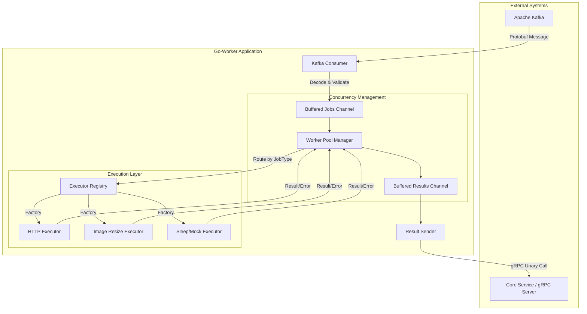

# Distributed Job Processing Worker (Go-Worker)

Высокопроизводительный компонент для асинхронной обработки фоновых задач в распределенной системе. Сервис спроектирован с упором на горизонтальную масштабируемость, отказоустойчивость и строгую типизацию данных.

Архитектура построена на базе паттерна **Fan-Out/Fan-In**, обеспечивая эффективную утилизацию ресурсов CPU и контролируемую нагрузку на внешние системы.

## Ключевые возможности

* **Высокая пропускная способность:** Реализован на Go с использованием эффективной модели конкурентности (goroutines).
* **Гарантированная доставка:** Использование Apache Kafka для получения задач обеспечивает персистентность и replayability (возможность повторной обработки).
* **Строгая типизация:** Все контракты данных описаны в Protobuf, что исключает ошибки парсинга и несовместимости версий на этапе компиляции.
* **Модульность:** Система плагинов (Executors) позволяет добавлять новые типы задач без изменения ядра воркера.
* **Graceful Shutdown:** Корректное завершение работы с ожиданием окончания текущих транзакций и коммитов в Kafka.
* **Observability:** Структурированное логирование (slog) в формате JSON для интеграции с ELK/Grafana Loki.

## Архитектура системы

Воркер функционирует как автономный юнит, получающий задачи из очереди сообщений и отправляющий результаты обработки через gRPC. Внутренняя коммуникация построена на буферизированных каналах, что позволяет сглаживать пиковые нагрузки (backpressure).

### Схема потока данных



### Компоненты

1. **Consumer Layer:** Поддерживает постоянное соединение с Kafka Brokers. Реализует логику "at-least-once" с ручным коммитом смещения (offset) только после успешной обработки или сохранения ошибки.
2. **Worker Pool:** Пул горутин фиксированного размера. Предотвращает перегрузку системы при резком росте количества входящих сообщений. Контролирует таймауты выполнения каждой отдельной задачи.
3. **Job Registry:** Паттерн "Стратегия". Динамически сопоставляет тип задачи (enum) с конкретной реализацией бизнес-логики.
4. **Result Sender:** Асинхронный компонент, отвечающий за надежную доставку результатов выполнения обратно в управляющий сервис через gRPC.

## Технологический стек

**Core:**

* **Language:** Go 1.25
* **Concurrency:** Channels, WaitGroups, Context propagation

**Communication & Data:**

* **Messaging:** Apache Kafka (библиотека `segmentio/kafka-go`)
* **RPC:** gRPC (Google implementation)
* **Serialization:** Protocol Buffers (proto3)

**Infrastructure & Ops:**

* **Configuration:** 12-factor app (переменные окружения через `sethvargo/go-envconfig`)
* **Containerization:** Docker (Multi-stage build, distroless/scratch optimization)
* **Logging:** `log/slog` (Structured Logging)

## Конфигурация

Сервис полностью настраивается через переменные окружения, что обеспечивает легкую интеграцию в Kubernetes или Docker Compose.

| Переменная | Описание | Значение по умолчанию |
|---|---|---|
| `KAFKA_BROKERS` | Список адресов брокеров Kafka | `required` |
| `KAFKA_TOPIC` | Топик для чтения задач | `job_requests` |
| `KAFKA_GROUP_ID` | Идентификатор консьюмер-группы | `required` |
| `WORKER_POOL_SIZE` | Количество параллельных воркеров | `10` |
| `GRPC_SERVER_ADDRESS` | Адрес сервера для отправки отчетов | `required` |
| `MAX_JOB_TIMEOUT` | Жесткий лимит времени на одну задачу | `30s` |
| `LOG_FORMAT` | Формат логов (json/text) | `json` |

## Расширение функционала

Добавление нового типа задачи производится декларативно и не требует изменения логики консьюмера или воркер-пула.

1. Добавьте новый тип задачи в `.proto` файл.
2. Реализуйте интерфейс `Executor`:

    ```go
    type Executor func(ctx context.Context, payload string) (string, error)
    ```

3. Зарегистрируйте новый экзекьютор в `init()` функции модуля:

    ```go
    func init() {
        jobregistry.Register(models.NewJobType, pb.JobTask_NEW_TYPE, factoryFunc)
    }
    ```

## Запуск и эксплуатация

### Локальный запуск

Требуется наличие `.env` файла в корне директории.

```bash
# Установка зависимостей
go mod download

# Запуск
go run cmd/worker/main.go
```

### Сборка Docker образа

Используется оптимизированная многоэтапная сборка. Финальный образ содержит только бинарный файл и корневые сертификаты, что минимизирует вектор атаки и размер образа.

```bash
docker build -t go-worker:latest .
docker run --env-file .env go-worker:latest
```
