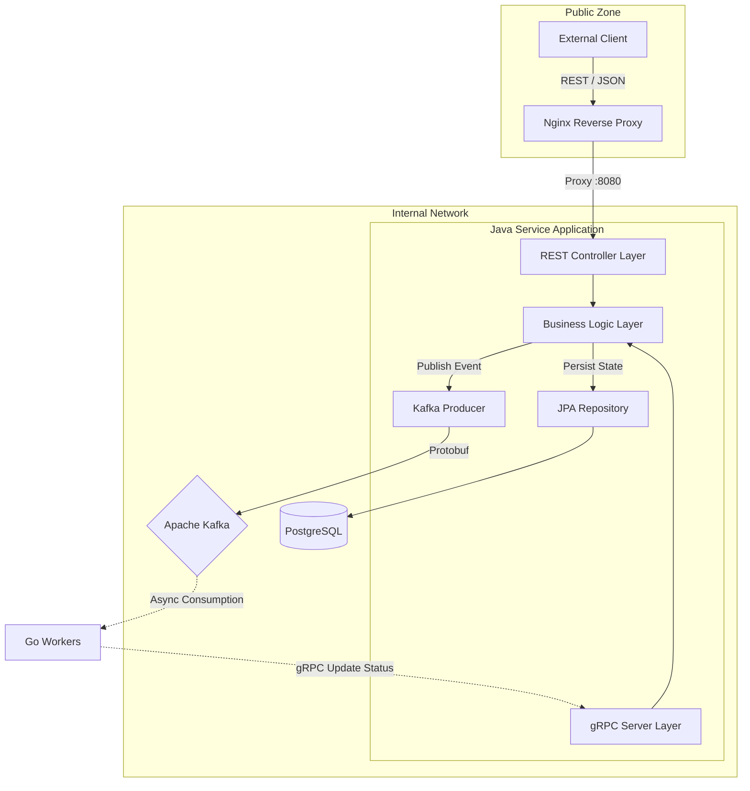

# Job Platform Control Plane (Java-Service)

Центральный компонент управления (Control Plane) распределенной платформы обработки задач. Сервис обеспечивает прием клиентских запросов, оркестрацию жизненного цикла задач, персистентное хранение состояний и диспетчеризацию нагрузки в асинхронную очередь.

Архитектура построена на принципах **CQRS (Command Query Responsibility Segregation)** на уровне потоков данных: синхронный прием команд через REST API и асинхронная передача исполнения в Data Plane через событийную шину.

## Ключевые возможности

* **Hybrid Communication:** Поддержка двойного интерфейса взаимодействия: REST API для внешних клиентов и gRPC сервер для высокоскоростного приема отчетов от воркеров.
* **Transactional Integrity:** Атомарные операции создания задач с использованием паттерна transactional outbox (гарантия согласованности БД и Kafka).
* **Protocol Buffers First:** Использование единых контрактов данных (.proto) для всех межсервисных взаимодействий, обеспечивающее строгую типизацию и бинарную эффективность.
* **Database Abstraction:** Использование Spring Data JPA для надежного управления персистентностью и миграциями схемы данных.
* **Security & Isolation:** Сервис работает в изолированной сети, не имеет прямого доступа извне (только через Reverse Proxy), что снижает поверхность атаки.

## Архитектура системы

Сервис выступает в роли единой точки входа (Gateway) и источника истины (Source of Truth) для всей системы. Он трансформирует внешние JSON-запросы в бинарные Protobuf-сообщения и управляет их маршрутизацией.

### Схема потока данных



### Компоненты

1. **REST Controller Layer:** Принимает HTTP-запросы от клиентов через Nginx. Выполняет валидацию входящих DTO, аутентификацию и маппинг в доменные модели.
2. **Business Logic Layer:** Ядро сервиса. Управляет транзакциями, координирует запись в БД и отправку сообщений в очередь. Реализует идемпотентность операций.
3. **Kafka Producer:** Компонент публикации событий. Сериализует объекты в Protobuf и отправляет их в топик `job_requests` с партиционированием по ID задачи для сохранения порядка.
4. **gRPC Server:** Высокопроизводительный RPC-интерфейс, принимающий обратную связь от воркеров. Позволяет обновлять статус задач (COMPLETED/FAILED) и сохранять результаты обработки с минимальной латентностью.
5. **Persistence Layer:** Слой доступа к данным на базе Hibernate/JPA. Обеспечивает надежное хранение истории задач и их текущих состояний в реляционной СУБД.

## Технологический стек

**Core:**

* **Framework:** Spring Boot 3.2 (Java 17)
* **Data Access:** Spring Data JPA / Hibernate
* **Build Tool:** Gradle (Kotlin DSL)

**Communication & Data:**

* **API:** Spring WebMVC (REST)
* **Messaging:** Spring Kafka
* **RPC:** gRPC-Spring-Boot-Starter (`net.devh`)
* **Database:** PostgreSQL 15
* **Serialization:** Protocol Buffers (proto3)

**Infrastructure:**

* **Containerization:** Docker (Multi-stage build based on Eclipse Temurin)
* **Reverse Proxy:** Nginx (Alpine)

## Конфигурация

Сервис следует методологии 12-factor app и конфигурируется через переменные окружения.

| Переменная | Описание | Значение по умолчанию |
|---|---|---|
| `SERVER_PORT` | Порт для REST API | `8080` |
| `GRPC_PORT` | Порт для gRPC сервера | `9090` |
| `POSTGRES_HOST` | Хост базы данных | `localhost` |
| `POSTGRES_DB` | Имя базы данных | `jobsdb` |
| `KAFKA_BROKERS` | Список брокеров Kafka | `localhost:9092` |
| `KAFKA_TOPIC` | Целевой топик для задач | `job_requests` |

## API Контракты

Сервис предоставляет RESTful интерфейс для управления задачами.

### Создание задачи

`POST /api/v1/jobs`

```json
{
  "type": "IMAGE_RESIZE",
  "payload": {
    "url": "https://example.com/image.jpg",
    "width": 1024,
    "height": 768
  }
}
```

### Получение статуса

`GET /api/v1/jobs/{id}`

```json
{
  "id": 123,
  "status": "COMPLETED",
  "result": "{\"s3_url\": \"...\"}",
  "created_at": "2024-02-03T12:00:00Z"
}
```

## Запуск и эксплуатация

### Сборка и запуск в Docker

Используется двухэтапная сборка (Builder -> Runtime) для минимизации размера образа. Контекст сборки должен быть установлен в корень монорепозитория для доступа к общим `.proto` файлам.

```bash
# Из корня проекта
docker-compose up --build java-service
```
